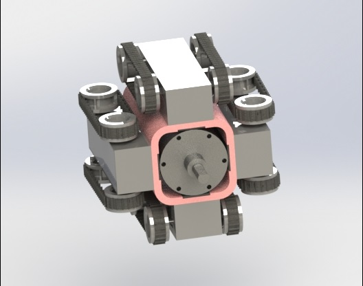

# Mechatronic_Earthworm
A futuristic agriculture solution employing swarm robotics to toil, irrigate and fertilize farms

One of the biggest industries in India is the agricultural industry and farmers are regarded as the pride of our nation. However, since the last 4 decades the percentage of farmers have steadily declined. The primary 2 factors for this issue are the lack of gains to the farmers and secondly the conditions and intensity of labour is not properly compensated. To develop a solution for this, an idea of a Mechatronic Earthworm was put forward in the National Design competition – Aakruti 2016, in the category of Futuristic Agriculture. 

Some Salient features that were defined while designing the project
	
	A tiny robot that works harmoniously with dozens of its kind.
	
	It can be used individually or in a whole group collectively to accomplish a task like ploughing, irrigating, fertilizing the field.
	
	The goal of our designing was to keep it modular. 
	
	Easy replacement, repairing, servicing and maintenance.
	
	A modular design will also allow different manufacturers to come up with new segments and new applications.
 
Design Structure
	
	While conceptualizing we designed the earthworm to be completely modular.
	
	The Mech Earthworm, just like an earthworm, is made up of segments.
	
	Each segment has a specific function towards a certain operation.
	
The following are the categories of Segments designed
	
	Drill (Mandatory)
	Motor Segment (Mandatory)
	Electronic/Sensor Segment (Mandatory)
	Fertilizer Segment (Optional)
	Irrigation Segment (Optional)
	Battery Segment (Mandatory)
	Drive Segment (Mandatory)

Mechanism
	
	Each Segment of the Mech Earthworm performs a particular task.
	The First Segment is responsible for steering the earthworm in 3D space.
	Each alternative segment is provided with a drive with motors so as to provide forward and reverse motion as well as providing the feed to the drill.
	The Segments are connected to each other using rigid links that enable turning in small radius.
	The worm can travel up till a depth of 12 inches below ground, which is the more than the maximum ploughing done by tractors.

First Segment
 
Four drives are used to help change the direction of the earthworm.
To turn right the two motors on the side and opposite to one another work together, one slowing down the other speeding up and therefore causing the turn.
These calculations can be preprogramed into the microcontroller while manufacturing.
Drive

 
The wheels are connected through continuous silicon rubber tracks to provide grip in different types of soils. Parallel drives work together to provide more power. It can also work in reverse.
Each drive has a wheelbase of 50mm and wheels of 20mm diameter.
It has a motor of specification- 12V 5Kg-cm 30RPM
Sensors and Microcontrollers
 
All the instructions are programmed into the micro controller.
A magnetic sensor is added to provide information about the physical location in 3D space.
A communication chip to communicate with the main computer and other earthworms.
Other Sensors like Humidity sensor and pH sensor can be added.
Irrigation/Fertilizer Segment
 
This segment is a general design and can be used for both purposes. 
An aluminium tank is used to store the contents.
A hole at the top to fill and empty the contents of the tank.
A stopper is provided at the top to block the hole once the tank is refilled.
Nozzles are attached at the rear which release the liquid.
Linkage
 
Plastic frames are attached at the ends of each segment.
They are snap fit and therefore can be easily attached and detached.
The spokes that radiate from the centre act as suspension.
A ball and socket joint provides a large degree of rotation that allows a small radius of turning.
Additional Features
	For charging of the earthworms Solar charging docks can be placed at various location on the farm. After reaching a certain battery level the Mech earthworms can go there and refill their charge.
	A visual programming software will be provided to the farmers. The software will have a simple user interface and will not need knowledge of any programming language.
	A red LED light will be placed on the electronic segment to send SOS signals in case of getting trapped or battery dying down.
	As it is a modular design 3rd party manufacturers can come up with newer segments.
Alternative Design Considerations

Drilling Torque Calculation
	Assume soil is a solid object
	Assume soil to have isotropic property
	Feed per tooth fz= 2mm				Feed rate Vf = 30mm/s
	Number of teeth z = 1						= 1800mm/min
	Feed per revolution f = fz x z = 2mm
	Speed (rpm) n = Vf/f 
	        		     = 900 rpm

	Specific Cutting force kc1.1 = 400 kN/m2    (Value from Mechanics of Machine Drilling)
            						 = 0.40 N/mm2
	Cut thickness h = fz x sin
  				    = 0.97128 mm
	Kc = kc1.1/ hmc   where mc = 0.25
          = 0.4029 N/mm2
	Torque T = (Dc2 x kc x f)/8000        where Dc = 100mm
		      = 1.0073 Nm
				or
		      = 10.073 kgcm	

